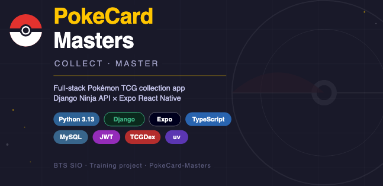

<div align="center">

# ⚡ Pokecard Masters

**Application mobile de gestion de collection de cartes Pokémon TCG — ouvre des boosters, construis ta collection, suis ta progression.**

[](https://github.com/Agarthaxx/pokecard_masters/actions)


</div>

---  



## Présentation

Pokecard Masters est une application mobile permettant de gérer sa collection de cartes du Jeu de Cartes à Collectionner Pokémon. Ouvre des boosters virtuels avec des tirages pondérés par rareté, parcours des milliers de cartes issues de l'[API TCGDex](https://tcgdex.dev), suis ta complétion du Pokédex et grimpe dans le classement des rangs.

Le backend est une API REST Django ; le frontend est une application React Native/Expo qui tourne sur iOS, Android et web.

---

## Fonctionnalités

| Fonctionnalité | Description |
|---|---|
| **Ouverture de boosters** | Ouvre des packs de 10 cartes avec tirage pondéré par rareté (Commun → Couronne) |
| **Collection de cartes** | Parcours ta collection, filtre par rareté, recherche par nom |
| **Pokédex** | Navigateur complet de toutes les cartes TCGDex |
| **Système de rangs** | 6 rangs de Novice à Maître selon le nombre de boosters ouverts |
| **Thèmes régionaux** | 9 régions Pokémon, chacune avec son propre thème coloré |
| **Double authentification** | Google OAuth + email/mot de passe, comptes liés par email |
| **Tableau de bord** | Complétion du Pokédex en %, compteur de cartes rares, dernières acquisitions |

---

## Architecture

```
┌─────────────────────────────────────┐     ┌──────────────────────────┐
│         Application Expo            │     │      API TCGDex           │
│  React Native 0.81 · TypeScript     │     │  (source des cartes)      │
│                                     │     └────────────┬─────────────┘
│  ┌─────────┐  ┌────────┐  ┌──────┐  │                  │ import_cards.py
│  │  Auth   │  │Booster │  │Pokédex│ │                  ▼
│  │ Context │  │  Tab   │  │  Tab │  │     ┌──────────────────────────┐
│  └────┬────┘  └────┬───┘  └──┬───┘  │     │      Backend Django       │
│       │            │         │      │     │                          │
└───────┼────────────┼─────────┼──────┘     │  API REST Django Ninja   │
        │            │         │            │  Auth JWT (Google + App)  │
        └────────────┴─────────┴──────────► │                          │
                   HTTPS / JWT              │  ┌──────┐  ┌──────────┐  │
                                            │  │ User │  │   Card   │  │
                                            │  │      │  │PlayerCard│  │
                                            │  └──────┘  └──────────┘  │
                                            │         MySQL             │
                                            └──────────────────────────┘
```

---

## Stack Technique

### Backend

| Couche | Technologie |
|---|---|
| Langage | Python 3.13 |
| Framework | Django 5.2 |
| API | Django Ninja 1.5 (REST + OpenAPI) |
| Auth | JWT (PyJWT) + Google OAuth 2.0 |
| Base de données | MySQL 8.0 |
| Gestionnaire de paquets | [uv](https://astral.sh/uv) |

### Frontend

| Couche | Technologie |
|---|---|
| Framework | Expo SDK 54 / React Native 0.81 |
| Langage | TypeScript 5.9 |
| Routage | Expo Router 6 (basé sur les fichiers) |
| Navigation | React Navigation 7 (drawer + onglets) |
| Style | NativeWind 4 (Tailwind pour RN) |
| Stockage Auth | expo-secure-store |
| Animations | react-native-reanimated |

---

## Installation

### Prérequis

- Python 3.13
- [uv](https://astral.sh/uv) — `curl -LsSf https://astral.sh/uv/install.sh | sh`
- Node.js 20+
- MySQL 8.0 en cours d'exécution sur `localhost:3306`

### 1 — Backend

```bash
# Installer les dépendances Python
uv sync

# Configurer l'environnement
cp project/.env.example project/.env
# Éditer project/.env avec les identifiants DB et les clés secrètes

# Appliquer les migrations de base de données
uv run python project/manage.py migrate

# Importer les cartes depuis TCGDex (~100 cartes, ~20s)
uv run python project/import_cards.py

# Démarrer le serveur de développement (port 8000)
uv run python project/manage.py runserver
```

#### Variables d'environnement (`project/.env`)

```env
DJANGO_SECRET_KEY=ta-clé-secrète
GOOGLE_CLIENT_ID=ton-google-client-id
GOOGLE_CLIENT_SECRET=ton-google-client-secret
DATABASE_NAME=pokemon
DATABASE_USER=root
DATABASE_PASSWORD=root
```

### 2 — Application Mobile

```bash
cd app_expo/app-pokemasters

# Installer les dépendances
npm install

# Configurer l'environnement
cp .env.example .env
# Éditer .env avec l'URL de l'API et les identifiants Google

# Démarrer le serveur Expo
npx expo start

# Spécifique à la plateforme
npx expo start --ios       # Simulateur iOS
npx expo start --android   # Émulateur Android
```

#### Variables d'environnement (`app_expo/app-pokemasters/.env`)

```env
EXPO_PUBLIC_API_BASE_URL=http://localhost:8000
EXPO_PUBLIC_GOOGLE_CLIENT_ID=ton-google-client-id
EXPO_PUBLIC_GOOGLE_CLIENT_SECRET=ton-google-client-secret
```

---

## Référence API

**URL de base :** `http://localhost:8000/api`

Documentation interactive disponible sur `/api/docs` (Swagger UI fourni par Django Ninja).

### Authentification

| Endpoint | Méthode | Auth | Description |
|---|---|---|---|
| `/auth/register` | POST | — | Inscription avec nom, email, mot de passe |
| `/auth/login` | POST | — | Connexion, retourne un JWT |
| `/auth/change-password` | POST | JWT | Changer le mot de passe |
| `/me` | GET | JWT | Récupère ou crée l'utilisateur depuis le token Google |
| `/me/profile` | GET | JWT | Profil complet de l'utilisateur |
| `/me/region` | PATCH | JWT | Mettre à jour la région Pokémon |

### Cartes

| Endpoint | Méthode | Auth | Description |
|---|---|---|---|
| `/cards` | GET | — | Toutes les cartes (filtre optionnel `?type=`) |
| `/user/pagination` | GET | JWT | Navigateur de cartes paginé |
| `/user/collection/pagination` | GET | JWT | Collection utilisateur paginée |
| `/player/card` | GET | JWT | Liste complète des cartes de l'utilisateur |

**Paramètres de pagination :** `page`, `limit`, `rarity`, `search`

### Boosters & Statistiques

| Endpoint | Méthode | Auth | Description |
|---|---|---|---|
| `/booster/open` | POST | JWT | Ouvrir un booster (retourne 10 cartes) |
| `/booster/count` | GET | JWT | Obtenir le nombre de boosters restants |
| `/stats` | GET | JWT | Complétion Pokédex, nombre de cartes rares, totaux |
| `/recent` | GET | JWT | Les 5 dernières cartes acquises |

---

## Mécanique des Boosters

Chaque booster contient **10 cartes** tirées du pool de cartes :

```
6 × Commune     (Un Diamant, Deux Diamants)
2 × Peu Commune (Trois Diamants, Quatre Diamants)
2 × Rare        (tirage pondéré)
```

Pondérations des cartes rares :

| Rareté | Poids |
|---|---|
| Un Brillant | 5.0 |
| Une Étoile | 4.0 |
| Deux Étoiles | 2.5 |
| Trois Étoiles | 1.5 |
| Deux Brillants | 0.8 |
| Couronne | 0.3 |

---

## Structure du Projet

```
pokecard_masters/
├── project/                    # Backend Django
│   ├── app/
│   │   ├── api.py              # Tous les endpoints REST (Django Ninja)
│   │   ├── models.py           # User, Card, PlayerCard, CardSet
│   │   ├── authentification.py # Auth JWT — Google + émis par l'app
│   │   ├── admin.py
│   │   └── migrations/         # 15 migrations de schéma
│   ├── project/
│   │   └── settings.py         # Config Django, CORS, DB
│   └── import_cards.py         # Script d'import des cartes depuis TCGDex
│
├── app_expo/app-pokemasters/   # Frontend Expo / React Native
│   ├── app/
│   │   ├── (auth)/             # Écrans Connexion · Inscription
│   │   └── (drawer)/(tabs)/    # Accueil · Booster · Pokédex · Profil · Paramètres
│   ├── context/
│   │   ├── AuthContext.tsx     # Gestion des tokens + actions d'auth
│   │   └── RegionContext.tsx   # État de la région active
│   ├── services/
│   │   └── api.ts              # Helper fetch avec headers d'auth
│   ├── constants/
│   │   ├── ranks.ts            # Seuils et libellés des rangs
│   │   └── pokedexNav.ts       # Helpers de navigation
│   └── components/             # Composants UI partagés
│
└── .github/workflows/
    └── test.yaml               # CI — Suite de tests Django sur MySQL
```

---

## Système de Rangs

Les rangs sont attribués selon le nombre total de boosters ouverts :

| Rang | Seuil | Icône |
|---|---|---|
| Novice | 0+ | 🌱 |
| Rookie | 5+ | ⚡ |
| Exploreur | 15+ | 🔥 |
| Expert | 30+ | 💎 |
| Champion | 60+ | 🏆 |
| Maître | 100+ | 👑 |

---

## Lancer les Tests

```bash
# Tests backend (nécessite MySQL en cours d'exécution)
uv run python project/manage.py test app

# Lint frontend
cd app_expo/app-pokemasters
npx expo lint
```

La CI s'exécute automatiquement à chaque push via GitHub Actions (voir [`.github/workflows/test.yaml`](.github/workflows/test.yaml)).

---

## Source des Données

Les données des cartes proviennent de l'**[API TCGDex](https://tcgdex.dev)** — une base de données Pokémon TCG ouverte et maintenue par la communauté. Le script d'import (`project/import_cards.py`) récupère les métadonnées des cartes et les stocke localement dans MySQL.

---

<div align="center">

Développé avec Django · Expo · MySQL · TCGDex

</div>
